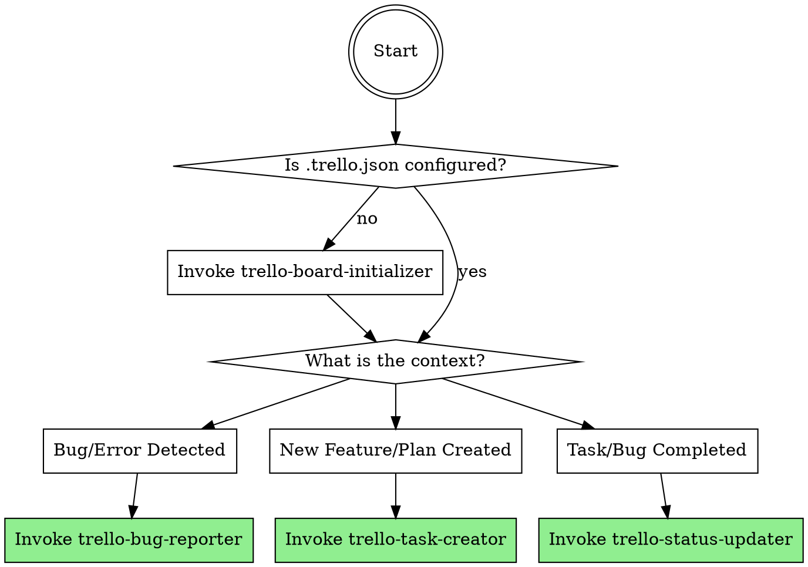

# Using Trello Orchestrator

## Prerequisites

This skill suite requires the **Trello MCP Server** to be installed and available to the agent.
- **MCP Server Repository:** [doITmagic/trello-mcp-complete](https://github.com/doITmagic/trello-mcp-complete)

Please ensure the MCP server is configured in your agent's settings before attempting to run any Trello workflows.

## Overview

This is the master router for the Trello MCP workflow. It dictates WHEN to invoke specific Trello skills. Do not attempt to manage Trello directly from this skill; instead, delegate to the sub-skills based on the user's current context.

**Core principle:** Always propose Trello actions proactively, but never execute them without user permission.

**Announce at start:** "I detected an opportunity to use Trello. Using the `using-trello` orchestrator to select the right action."

## The Trello Flow

## Mandatory Routing Rules

When you detect one of the contexts below, you MUST invoke the corresponding sub-skill:

1. **Board Setup:** If this is the first time Trello is mentioned in the project, or if `.trello.json` is missing:
   - **REQUIRED SUB-SKILL:** Use `trello-board-initializer`

2. **Bugs & Errors:** If a test fails, an exception is thrown, or the user reports unexpected behavior:
   - **REQUIRED SUB-SKILL:** Use `trello-bug-reporter`

3. **Planning & Ideas:** If the user says "we should build X", "here is my plan", or after generating an implementation plan:
   - **REQUIRED SUB-SKILL:** Use `trello-task-creator`

4. **Completion:** If tests pass, a PR is ready, or a bug is confirmed fixed (after verification):
   - **REQUIRED SUB-SKILL:** Use `trello-status-updater`

## Red Flags

- Never attempt to create or move cards directly from this skill. Always dispatch the specific sub-skill.
- Never spam the user. Ask ONE polite question proposing the Trello action.
- Always wait for user approval before creating or modifying any Trello cards.
